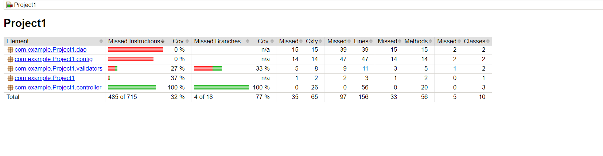
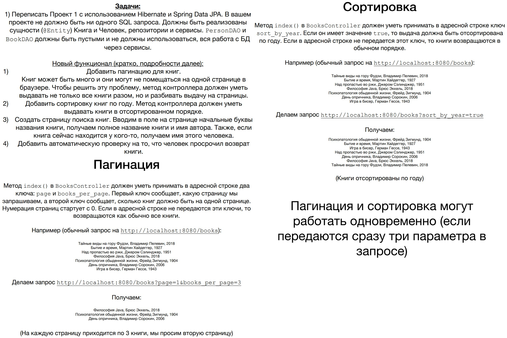
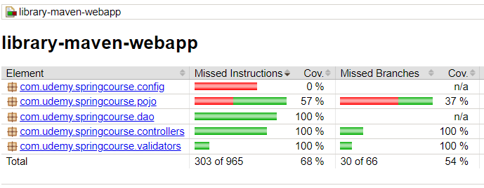

# SpringBootCourse

I taking a course ["Spring - Полный курс. Boot, Hibernate, Security, REST"](https://www.udemy.com/course/spring-alishev/), 
taught by Nail Alishev on the Udemy.com platform. The learning process was documented in this repository.

During the course, three training projects were completed.

**Update:** Based on the course  
["Spring Boot Unit Testing with JUnit, Mockito and MockMVC"](https://www.udemy.com/course/spring-boot-unit-testing/)
I have covered all the projects with unit and integration tests. Since the course taught me how to test only SpringBoot applications, 
I had to experiment and research extensively to handle other configurations.

## Project 1

---

The functionality has been fully implemented.

The application is deployed on Tomcat-9 and accessible at http://localhost:8080/library.

Technologies used: Java 17 SE, Apache Maven, Apache Tomcat, JDBC, PostgreSQL, Spring Core, Spring MVC, Lombok, Thymeleaf, HTML, CSS.

---

Main pages:

Creating and editing a reader (with validation):

Creating and editing a book (with validation):

Reader profile, book profile, releasing a book when deleting a reader:

Test covage report:

## Project 2

---

The functionality has been fully implemented.

The application is deployed on Tomcat-9 and accessible at http://localhost:8080/library.

Technologies used: Java 17 SE, Apache Maven, Apache Tomcat, MySQL, Hibernate, Spring Core, Spring MVC, Spring Data, Lombok, Thymeleaf, HTML, CSS.

---

The main CRUD functionality of the application has remained unchanged.

To avoid manually entering parameters in the address bar, I added a parameter input form for sorting/pagination on the book view page:

Book search page:

If a reader has borrowed a book more than 10 days ago, the book is considered overdue and is highlighted in red on their page. To demonstrate this solution, I used an SQL query to manually change the book's borrow date. The video was recorded on October 15, 2022.

Test coverage report:

